# 📘 BIBLE Session — Architecture & Principles

**Date:** 2026-05-25 → 2026-05-26
**Session:** BIBLE (5 sub-sessions)
**Branch:** `claude/sleepy-heisenberg-5OycV` → main
**Final commits on main:** `ad00e28` · `0e8eff4` · `65a1b5d` · `731f25a`

---

## 📑 Table of Contents

1. Triangulation Pipeline (Shipped)
2. Master Dictionary v1.4.0
3. 📌 FOUNDATIONAL RULE #1
4. Coding Process — Data-Driven
5. LLM Control — 6 Layers
6. Memory Architecture
7. Session Commits
8. Open Questions

---

# ① Triangulation Pipeline ที่ Ship แล้ว

> **Goal:** Merge หลาย source (100CH + LLMs + user) เป็น KB เดียวที่ trust สูงและ verifiable

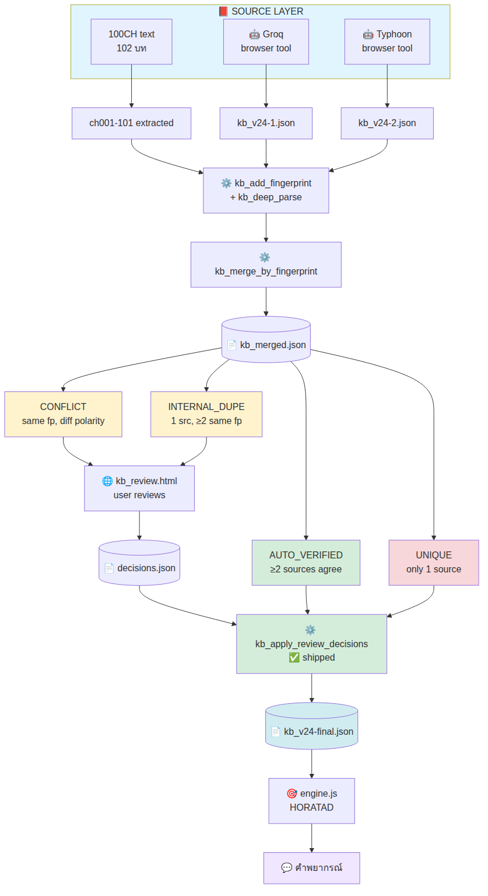

**Status:** Pipeline ครบ end-to-end ✅
**Blocker เดียว:** user ต้องรัน Groq + Typhoon ที่ browser tool เพื่อปลดล็อค real triangulation

---

# ② Master Dictionary v1.4.0-complete

> **File:** `v3/master_dict_meanings.json`
> **Score:** 10 ✅ + 1 🟡 (by design — `special_configs` grows organically)

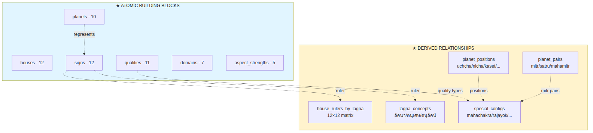

## Section Summary

| Section | Content |
|---|---|
| **planets** (10) | ดาว 10 ดวง + represents + life domains + body parts + career |
| **houses** (12) | ภพ 12 + ความหมาย + priority |
| **qualities** (11) | เกษตร / อุจ / มหาจักร / ราชาโชค / ... + กฎ ลบ-ลบ=บวก |
| **domains** (7) | ตัวตน / การเงิน / ความรัก / สุขภาพ / หน้าที่การงาน / ความสูญเสีย / ทั่วไป |
| **aspect_strengths** (5) | กุม 100% / เล็ง 75% / โยค 50% / ตรีโกณ 25% / NONE |
| **signs** (12) | ราศี + ruler + element + nature + represents + keywords |
| **planet_positions** (10) | uchcha / nicha / kaset / prakaset / mahachak + uchajavilas / uchajaphimukh |
| **planet_pairs** | mitr `[(1,5)(2,4)(3,6)(7,8)]` · satru `[(1,3)(4,8)(6,7)(2,5)]` · mahamitr `[(7,8)]` |
| **lagna_concepts** (5) | ลัคนา + ตนุเศษ + ตนุลัคน์ + กุมลัคนา + 3-layer model |
| **house_rulers_by_lagna** | 12×12 matrix (derived from `signs.ruler_planet_id`) |
| **special_configs** (11) | mahachakra / rajayok / anukaset / kum_lakkana / นิจ-อุจ rules / ... |

## Sample Entries

| Path | Sample |
|---|---|
| `planets[1]` | อาทิตย์ · ไฟ · บาป · [ตัวตน, อำนาจ, บิดา, ราชการ] |
| `signs[5]` | สิงห์ · ruler=1 (อาทิตย์) · ไฟ-กลาง · คงที่ |
| `planet_positions[3]` | อังคาร · uchcha=มกร · nicha=กรกฎ · kaset=[เมษ, พิจิก] |
| `planet_pairs.mitr` | `[[1,5], [2,4], [3,6], [7,8]]` |
| `house_rulers_by_lagna[5]` | สิงห์ lagna → rulers=`[1,4,6,3,5,7,8,5,3,6,4,2]` |
| `lagna_concepts.tanusesh` | `(a × b) mod 7` → planet_id 1-7 only |
| `special_configs.mahachakra` | คู่ดาวมิตรในเรือนเกษตรของกัน (4 examples) |

---

# ③ 📌 FOUNDATIONAL RULE #1 (PINNED v3)

> **User-confirmed principle ที่ rewrite วิธีคิดทุก interpretation**

## กฎหลัก

> **พื้นดวง (natal) = 80% ของคำพยากรณ์ทั้งหมด**
>
> **ดวงจร (transit) = stimulator เท่านั้น** — activate สิ่งที่ natal บอกไว้แล้ว
>
> **ดวงจรไม่สร้างผลที่ natal ไม่มี**

## Interpretation Flow

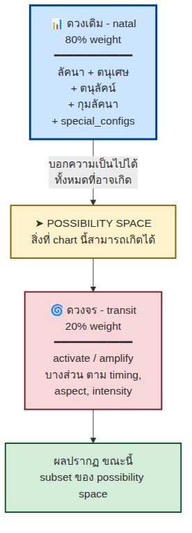

## Corollary — ดวงคล้ายกัน

> **2 คนที่ natal คล้ายกัน → outcome TYPE เดียวกัน**
> **สิ่งที่ทำให้ต่างคือ "ดาวจร"**

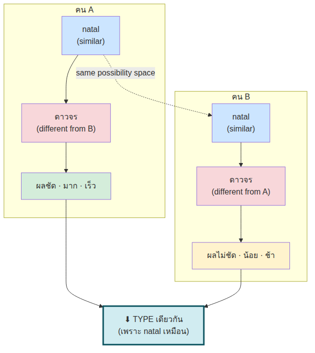

## 5-Dimension Matrix

| มิติ | กำหนดโดย | เพราะ |
|---|---|---|
| **WHAT** (type ของผล) | 🔵 **natal** | fixed ตั้งแต่เกิด |
| **WHEN** (timing) | 🟡 **ดาวจร** | window ของ activation |
| **HOW CLEAR** (ผลชัด/ไม่ชัด) | 🟡 **ดาวจร** | aspect quality + duration |
| **HOW MUCH** (มาก/น้อย) | 🟡 **ดาวจร** | activation intensity |
| **HOW OFTEN** (frequency) | 🟡 **ดาวจร** | cycle through aspect angles |

## Anti-Patterns (อย่าเขียน wording แบบนี้)

> ❌ **WRONG:** "ดาวจรเสาร์ผ่านลัคนา → จะเสียงาน"
> *(transit standalone prediction — Rule #1 violation)*
>
> ✅ **RIGHT:** "ดาวจรเสาร์ผ่านลัคนา → activate ความเสี่ยงเรื่องงานที่ natal บอกไว้ (เช่น พุธในกรรมแย่)"

> ❌ **WRONG:** "ดาวจรพฤหัสทับลาภะ → จะรวย"
>
> ✅ **RIGHT:** "ดาวจรพฤหัสทับลาภะ → activate potential ที่ natal บอก (ลาภะดี + พฤหัสตำแหน่งดีใน natal)"

## Evidence from 100CH

**R289** — 4 ดาวจรร้าย + ดวงเข้มแข็ง + คู่มิตรรับ → **ไม่ถึงฆาต**

> ตรง: ถ้า natal เข้มแข็ง, transit ร้ายเอาชนะไม่ได้ → ยืนยันหลัก natal=80%

---

# ④ Coding Process — Data-Driven (No If/Else Maze)

## Architecture Principle

- **Knowledge → JSON** (rules + master_dict)
- **Code → tiny pipeline** (extract → match → render)
- **Conditions → fingerprints + filters** (set theory, ไม่ใช่ branching)
- **Special rules → architectural enforcement** (function signatures, schema)
- **Reasoning → LLM** (KB + master_dict เป็น prompt context)

## 5-Step Pipeline

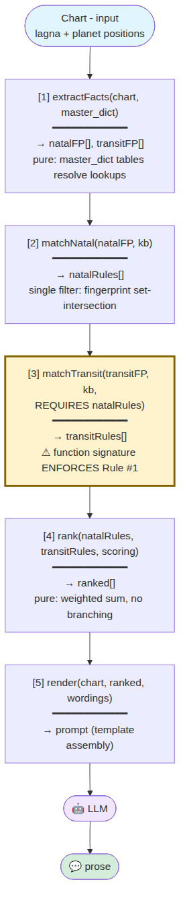

## Apparent If/Else → Actually Data Lookup

| What looks like a branch | Actually implemented as |
|---|---|
| "ถ้าดาวอยู่ราศีนี้ → ..." | KB rule + fingerprint match |
| "ถ้า quality เป็นอุจ → ..." | `master_dict.qualities[id]` lookup |
| "ถ้ามี mahachakra → ..." | `special_configs.mahachakra` check |
| "ถ้า lagna = X → ruler = Y" | `house_rulers_by_lagna[X]` pre-derived |
| "transit ต้องมี natal anchor" | function signature param requirement |

## Why No If/Else Maze

| Bad design | Good design (ours) |
|---|---|
| Nested if/else per condition | Filter on fingerprint set |
| Code grows exponentially | Data scales linearly |
| New rule = edit code | New rule = add JSON row |

> **เป้า:** `engine.js` < 500 บรรทัด เพราะ logic ทั้งหมดอยู่ใน JSON

---

# ⑤ LLM Control — 6-Layer Constrained Generation

> **หลัก:** บีบ decision space ของ LLM ลงให้เล็กที่สุด → เหลือแค่งานง่าย (paraphrase ไม่ใช่ predict)

## Decision Space Comparison

| | Decision Space | Hallucination Chance |
|---|---|---|
| **WITHOUT KB** | "พยากรณ์อะไรก็ได้" ≈ infinite | ⚠ HIGH |
| **WITH KB** | "เรียบเรียง 25 rules ที่ให้มา" ≈ small | ✓ LOW |

## The 6-Layer Stack

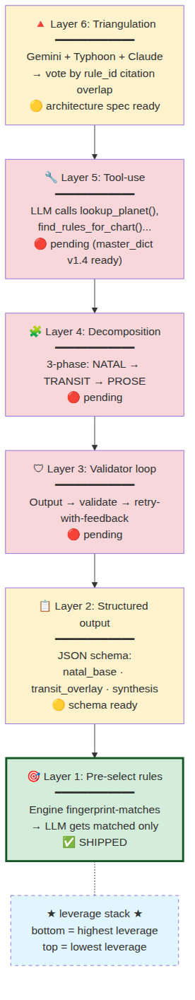

## Full Generation Flow (All Layers Combined)

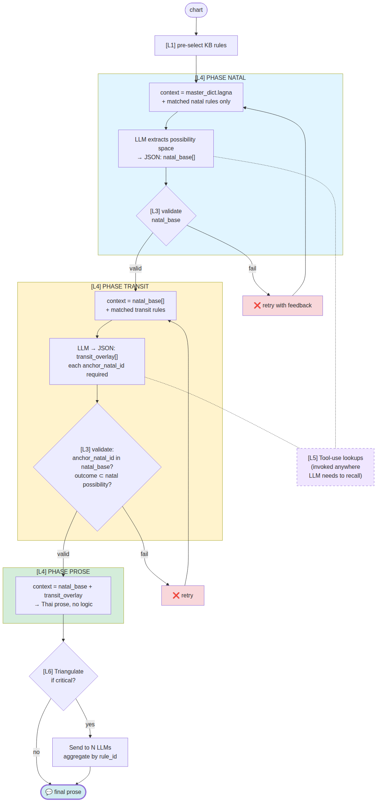

## Layer 2 — Structured Output Schema

```json
{
  "natal_base": [
    {
      "rule_id": "R013",
      "domain": "ตัวตน",
      "statement": "..."
    }
  ],
  "transit_overlay": [
    {
      "rule_id": "R191",
      "anchor_natal_id": "R013",
      "activation": "...",
      "statement": "..."
    }
  ],
  "synthesis": "...",
  "confidence": {
    "R013": 0.9,
    "R191": 0.7
  }
}
```

`anchor_natal_id` field บังคับ Corollary (transit อ้าง natal)

## Layer 3 — Validator Decision Tree

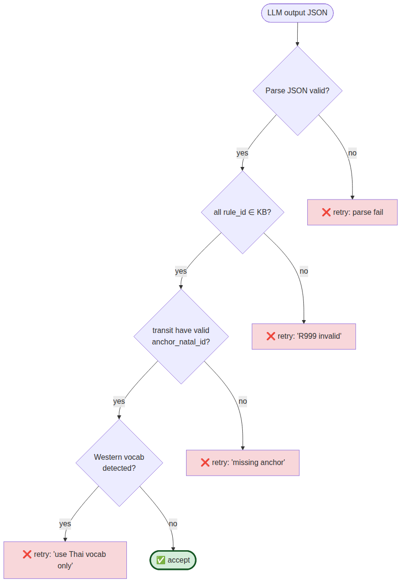

## Layer 6 — Triangulation Voting

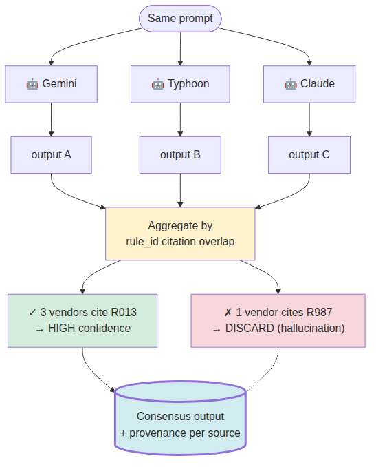

## Implementation Status & Next Steps

| Layer | Status | Effort | Next action |
|---|---|---|---|
| **1** | ✅ shipped (POC v2) | done | iterate scoring per chart type |
| **2** | 🟡 schema ready | ~1 session | enforce in prompt + add parser |
| **3** | 🔴 not started | ~1 session | `workers/llm_output_validator.mjs` 🔥 |
| **4** | 🔴 not started | ~2 session | scaffold 3-phase prompt templates |
| **5** | 🔴 not started | ~1 session | `workers/llm_tools.mjs` (6 funcs) |
| **6** | 🟡 architecture spec | user-blocked | user runs Groq + Typhoon → compare |

> **Recommended next order:** 3 → 2 → 4 → 5
> (Layer 3 has highest leverage — blocks hallucination at gate)

---

# ⑥ Memory Architecture & Process Rules

## Memory File Layout

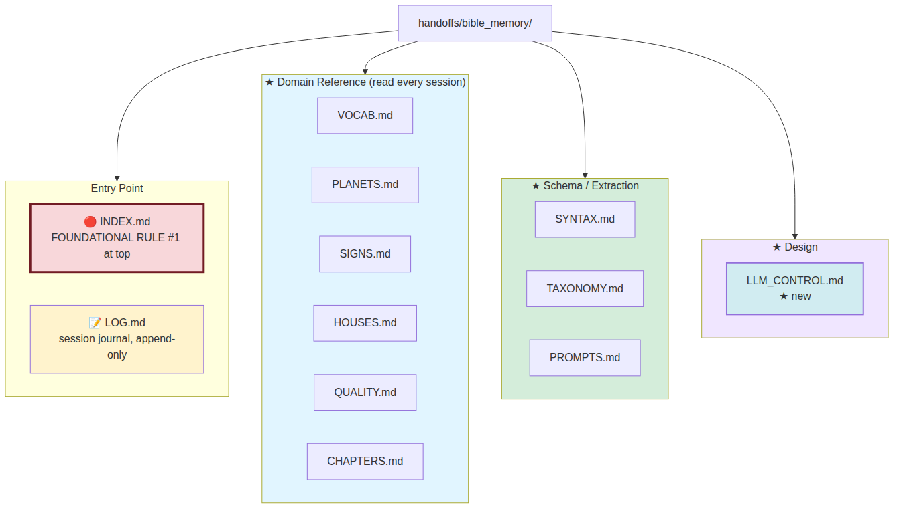

## "Should Claude Fill the Skeleton?" — 4-Test Decision Tree

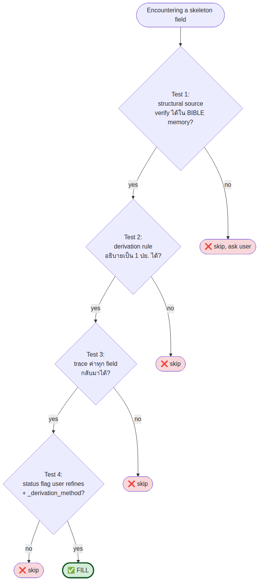

## LOG → Reference Promotion Flow

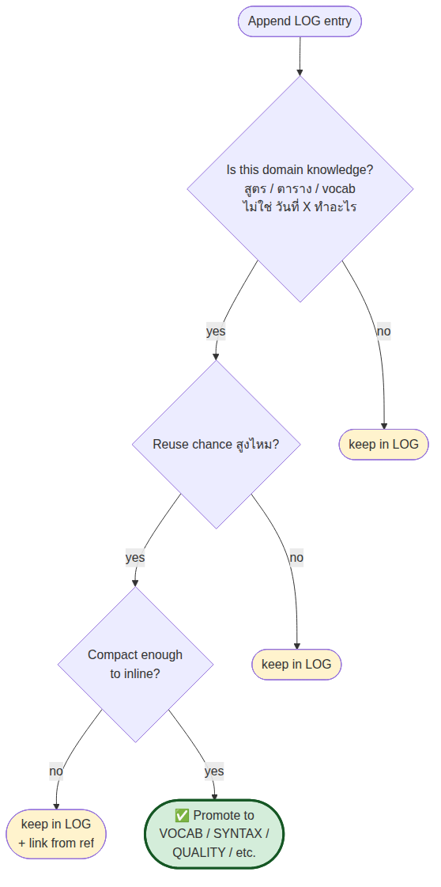

## Append-Only Rule

> **NEVER edit old entries** — append new entry + note `"supersedes YYYY-MM-DD"`

## Critical Discoveries This Session

| Discovery | Impact |
|---|---|
| `workers/chapter_texts.json` contains ch000-ch101+ raw | Future sessions can extract without user Q&A |
| Master dict 1-12 vs KB 0-11 ID mismatch | Bridge fields added (`canonical_*_id`) |
| `signs.represents` derivable from ruler+element+nature | Pattern for similar narrative fills |

---

# ⑦ Session Commits Timeline

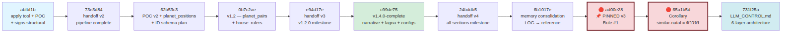

| Commit | Content |
|---|---|
| `abfbf1b` | apply tool + wording POC + master_dict signs (structural) |
| `73e3d84` | handoff v2 — pipeline complete, archive v1 |
| `62b53c3` | POC scoring v2 + planet_positions + ID schema plan |
| `0b7c2ae` | master_dict v1.2.0 — planet_pairs + house_rulers_by_lagna |
| `e94d17e` | handoff v3 — master_dict v1.2.0 milestone |
| `c99de75` | master_dict v1.4.0-complete — signs narrative + lagna_concepts + special_configs |
| `24bddb5` | handoff v4 — all sections milestone |
| `6b1017e` | memory consolidation — promote LOG to reference files |
| **`ad00e28`** | **📌 PINNED v3 — Foundational Rule #1 (natal 80% / transit = stimulator)** |
| **`65a1b5d`** | **Corollary — similar-natal differentiation = ดาวจร** |
| `731f25a` | LLM_CONTROL.md — 6-layer Constrained Generation architecture |

---

# ⑧ Open Questions

## ⭐ User Decisions (pending)

| Decision | Affects |
|---|---|
| Wording selection policy (IN_BOOK first / rotate / chart-context) | engine.js wording picker |
| Production-ready threshold (≥2 sources / user marks ✓ / both) | what flows to engine vs reviewer |
| ID schema migration trigger (1-12 → 0-11) | when 3rd consumer needs canonical IDs |

## ⭐ User Actions (sandbox can't do)

| Action | Tool |
|---|---|
| Run Groq mode → `kb_v24-1_fp.json` | `tools/kb_extract.html` |
| Run Typhoon mode → `kb_v24-2_fp.json` | `tools/kb_extract.html` |
| Review 32 INTERNAL_DUPE → export decisions | `tools/kb_review.html` |

## 🟢 Claude Can Do Next (priority order)

1. 🔥 **Layer 3 validator** (~1 session, highest leverage)
2. 📋 **Layer 2 schema enforcement** + parser
3. 🧩 **Layer 4 decomposition prompts** (3-phase)
4. 🔧 **Layer 5 tool-use wrapper** (master_dict)
5. 🎯 POC scoring v3 (special_configs awareness)
6. 📚 Deeper chapter extraction (ch004-006, ch038)
7. 💬 Q&A intelligence test (master_dict alone)

---

# 📎 Appendix — Quick Reference

| Topic | Summary |
|---|---|
| 📐 **RULE #1** | พื้นดวง = 80% · ดาวจร = stimulator only |
| 🔄 **Pipeline** | extract → match → merge → review → apply → engine |
| 🎯 **LLM** | 6 layers — pre-select / struct out / validate / decompose / tools / triangulate |
| 💾 **Master dict** | v1.4.0 complete — 10 ✅ + 1 🟡 |
| 📜 **Code** | data-driven, no if/else, fingerprint match |
| 🧠 **Memory** | INDEX → LOG → reference files; append-only |

---

*Generated 2026-05-26 — BIBLE session continuation*
