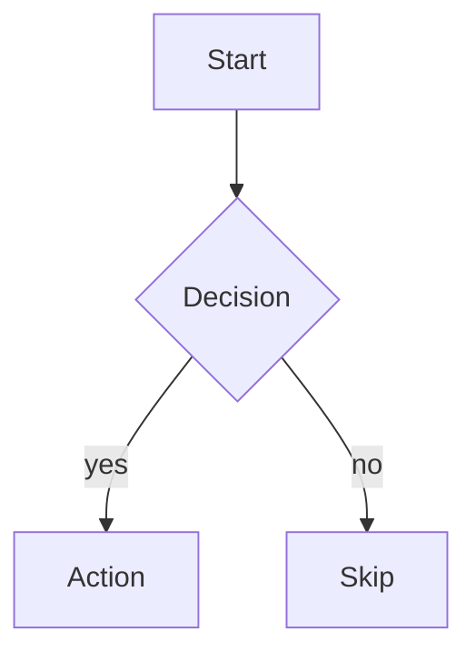
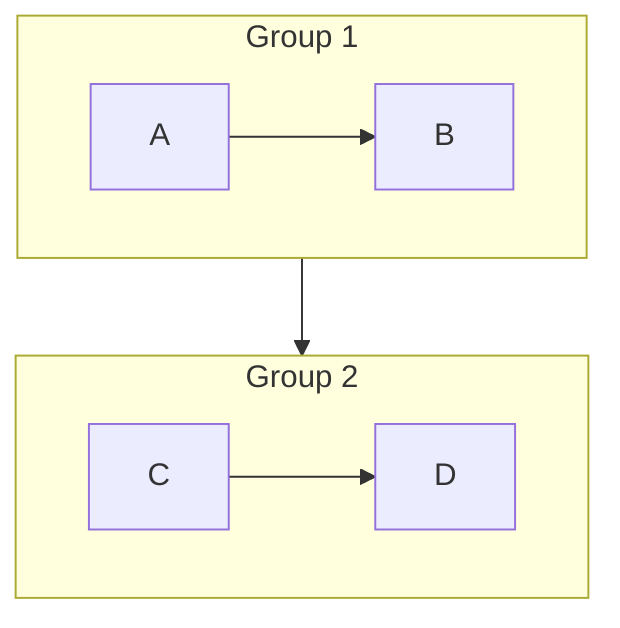

# Doc Generation Standard — Google Docs ready

> **Use case:** สร้างเอกสาร share ออกไป Google Docs (presentation, summary, spec) ที่ต้องมี flowchart/diagram สวยๆ

## Workflow

```
1. Author markdown + Mermaid sources (text, git-versioned)
2. Run tools/render_doc.sh <dir>
   → Mermaid *.mmd → *.png (vector-quality)
   → markdown.md → markdown.docx (Pandoc, embedded PNGs)
3. Upload .docx to Google Drive → Open with Google Docs
   → headings/tables/images/code-blocks render auto
```

## Folder structure (per doc)

```
docs/<doc_name>/
  <doc_name>.md          ← markdown source (single .md file)
  diagrams/
    <01_topic>.mmd       ← Mermaid source (versioned)
    <01_topic>.png       ← rendered (generated, can re-render)
    <02_topic>.mmd
    <02_topic>.png
    ...
```

**Naming convention:**
- ใช้ prefix `01_`, `02_` เพื่อ ordering ตามที่อยู่ใน doc
- file name สั้น snake_case (`pipeline`, `rule1_flow`, `llm_stack`)

## Quick start (copy template)

```bash
# 1. Copy template
cp -r docs/templates/example_doc docs/my_new_doc
cd docs/my_new_doc

# 2. Edit my_new_doc.md (rename from example.md)
mv example.md my_new_doc.md

# 3. Edit/add diagrams in diagrams/
# 4. Render + convert
bash tools/render_doc.sh docs/my_new_doc

# 5. Upload my_new_doc.docx to Google Drive
```

## Markdown patterns ที่ render สวย

### Headings → Google Docs navigation
```markdown
# H1 (one per doc)
## H2 (TOC entries)
### H3 (sub-sections)
```

### Images → embedded PNGs
```markdown

```

### Tables → Google Docs tables (สวยจริง)
```markdown
| Col A | Col B |
|---|---|
| ... | ... |
```

### Callouts → blockquote
```markdown
> ⚠ **Warning:** ...
> ✅ **Tip:** ...
```

### Code blocks → monospace
```markdown
​```json
{ "key": "value" }
​```
```

## Mermaid patterns ที่ render ดี

### Flowchart top-down


### Flowchart left-right (timeline)


### Subgroups (boxes around clusters)


### Color status


**Standard color palette (project-wide):**

| Hex | Use |
|---|---|
| `#d4edda` | ✅ done / success |
| `#fff3cd` | 🟡 partial / pending |
| `#f8d7da` | 🔴 blocked / error |
| `#e1f5ff` | 🔵 source / input |
| `#d1ecf1` | 🟦 output / artifact |
| `#f0e6ff` | 🟣 LLM / external |
| `#cce5ff` | natal / fixed data |
| `#856404` border on `#fff3cd` | warning emphasis |
| `#721c24` border on `#f8d7da` | critical emphasis |
| `#155724` border on `#d4edda` | success emphasis |

## Dependencies

| Tool | Install |
|---|---|
| `mmdc` (Mermaid CLI) | `npm install -g @mermaid-js/mermaid-cli` |
| `pandoc` | `apt install pandoc` / `brew install pandoc` |
| Chromium (for Mermaid render) | Auto-detected at `/opt/pw-browsers/...` ใน sandbox |

## Examples in repo

- `docs/bible_session_summary_2026-05-26/` — first artifact built with this workflow (13 diagrams)

## When to use

✅ **Use this workflow when:**
- Share เอกสารออกไป Google Docs / Drive
- ต้องมี diagrams สวย (pipeline, decision tree, architecture)
- คาดว่ามีหลาย version (re-render หลังแก้)

❌ **Don't use when:**
- Internal handoff / memory file (markdown ปกติพอ — อ่านใน IDE)
- One-off note (overhead ไม่คุ้ม)
- Plain text status update
