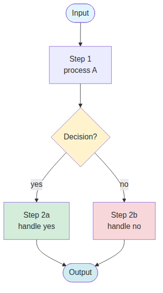

# 📘 Example Doc Title

**Date:** YYYY-MM-DD
**Owner:** [PROJECT_CODE]
**Status:** Draft / Review / Final

---

## 📑 Table of Contents

1. Section 1
2. Section 2

---

# ① Section 1 — Overview

> **Goal:** บอกวัตถุประสงค์ section ใน 1 ประโยค

ใส่ flowchart ที่นี่:



## Sub-heading

| Column A | Column B |
|---|---|
| Data 1 | Data 2 |
| Data 3 | Data 4 |

> ✅ **Tip:** ใช้ blockquote สำหรับ callouts/principles
>
> Multi-line callout ทำได้

---

# ② Section 2 — Another Topic

## Code example

```json
{
  "key": "value",
  "nested": {
    "field": 42
  }
}
```

## Status table

| Item | Status | Notes |
|---|---|---|
| Task A | ✅ done | committed `abc1234` |
| Task B | 🟡 partial | in progress |
| Task C | 🔴 blocked | waiting user |

---

*Generated YYYY-MM-DD — [project] session*
