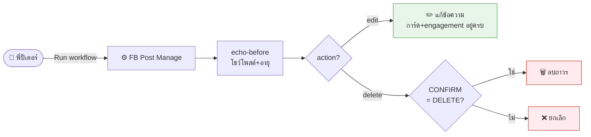
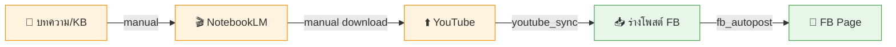
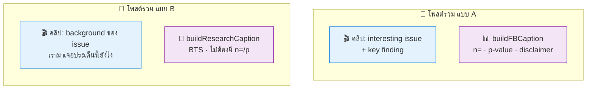
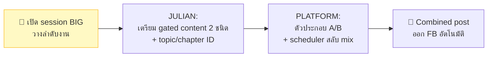

# 📋 Session Report — PLATFORM
### Facebook Content Pipeline: Caption · Ops · Vision
**วันที่:** 2026-05-29 · **Scope:** PLATFORM · **Branch:** `claude/kind-feynman-eW98I`

> รายงานสรุปบทสนทนาทั้ง session — เก็บไว้อ้างอิง (พี่ปีเตอร์)
> TALS = Thai Astrology Logical Style · ผู้ก่อตั้ง: ยืนยง นาวาสมุทร (แดง เมืองตราด)

---

## 🎯 TL;DR — session นี้ทำอะไรบ้าง

| # | เรื่อง | ผลลัพธ์ |
|---|---|---|
| 1 | **Caption FB สะอาดสไตล์ EP05** | ✅ ส่งมอบ + migrate 96 ไฟล์เก่า |
| 2 | **แก้ EP01 (โพสต์เก่ารก)** | ✅ พี่ปีเตอร์ Edit เอง + sync record |
| 3 | **ปิด F5** (ยืนยัน `link` param) | ✅ ปิด |
| 4 | **fb_post_manage** (แก้/ลบโพสต์) | ✅ ส่งมอบ workflow + กันชน |
| 5 | **คุยเรื่อง FB ops อัตโนมัติ** | 📌 ได้ข้อสรุป (ดูส่วนที่ 3) |
| 6 | **คุยเรื่อง auto video pipeline** | 📌 NotebookLM ไม่มี API |
| 7 | **🔭 Vision: Combined post** | 📌 design ตกผลึก รอวางแผน BIG |

---

## 1. งานที่ส่งมอบแล้ว (Shipped)

### 1.1 Caption FB สไตล์ EP05 — สะอาด อ่านง่าย

**ปัญหาเดิม:** โพสต์ EP01 รก — มีชื่อตอนซ้ำ + URL เปลือยยาว + hashtag 4 ตัว ก่อนถึงกล่องวิดีโอ

**แก้เป็น:** hook นำ → ปล่อยให้การ์ดวิดีโอทำงาน

```
  ── ก่อน (EP01) ────────────         ── หลัง (EP05 style) ──────────
  ทำไมราศีเมษต้องเริ่มที่เลข 0 (6 นาที)   อยากเริ่มศึกษาโหราศาสตร์ไทย
                                          แต่ไม่รู้จะเริ่มตรงไหน?...
  อยากเริ่มศึกษา...อย่างไร          →
                                          #โหราศาสตร์ไทย #TALS #โหราทาส
  ▶️ ดูวิดีโอเต็ม: https://...
                                          [การ์ดวิดีโอ]
  #โหราศาสตร์ไทย #TALS #โหราทาส #HoratadAI
  [การ์ดวิดีโอ]
```

**สิ่งที่เปลี่ยน** (`workers/youtube_sync.mjs` → `buildCaption()`):
- ✅ ขึ้นต้นด้วย **hook** (ประโยคดึงความสนใจ) แทนชื่อตอนซ้ำ
- ✅ **ตัด URL เปลือย** — ปลอดภัยเพราะ `fb_autopost` ส่ง `link` แยกให้ FB ทำการ์ดอยู่แล้ว
- ✅ **hashtag เหลือ 3** — ตัด `#HoratadAI` (ซ้ำชื่อเพจ)
- ✅ **migrate 96 ไฟล์เก่า** ในคิว (inbox 86 + scheduled 10) → สไตล์เดียวกันทั้งหมด

### 1.2 แก้ EP01 (โพสต์ที่ live แล้ว)

- **วิธี:** Edit ข้อความเดิม **ไม่ลบ-โพสต์ใหม่** → เก็บ like/comment/อายุ 23 ชม. ครบ การ์ดวิดีโอยังอยู่
- พี่ปีเตอร์กดแก้บน FB เอง (sandbox แตะ FB ไม่ได้) + ผม sync record ใน `content/posted/` ให้ตรง

### 1.3 ปิด F5 — ยืนยันกลไกการ์ดวิดีโอ

`fb_autopost.mjs:74-76` ส่ง `params.link = meta.youtube_url` **แยกต่างหาก** → FB ทำ preview card เอง = **ไม่ต้องพึ่ง URL ในข้อความ** → ตัด URL เปลือยได้ปลอดภัย (พิสูจน์แล้วตอนพี่ปีเตอร์ Edit EP01 การ์ดยังอยู่)

### 1.4 fb_post_manage — เครื่องมือแก้/ลบโพสต์ที่เผยแพร่แล้ว

เครื่องมือใหม่สำหรับงาน FB ops ที่ sandbox ทำไม่ได้ (`workers/fb_post_manage.mjs` + `.github/workflows/fb_post_manage.yml`) — รันบน GitHub Actions (กดเอง)



**กันชนความปลอดภัย (drawback = destructive + กู้ไม่ได้):**
| กันชน | ผล |
|---|---|
| echo-before | โชว์ข้อความ+อายุก่อนลงมือ (เห็นว่ายิงถูกตัว) |
| our-page-only | POST_ID ต้องขึ้นต้น `<FB_PAGE_ID>_` (กันผิดเพจ) |
| delete ต้อง `CONFIRM=DELETE` | กันลบพลาด |
| คนกดเท่านั้น | ไม่มี schedule · ไม่ให้ automation/Claude เรียก |

---

## 2. การตัดสินใจสำคัญ + เหตุผล (Decisions & Rationale)

| การตัดสินใจ | เลือก | ทำไม (ภาษาคน) |
|---|---|---|
| URL ในแคปชั่น vs ตัดทิ้ง | **ตัดทิ้ง** | การ์ดวิดีโอกดได้อยู่แล้ว URL ซ้ำซ้อน + รก ไม่ช่วยคนอ่าน |
| ส่ง `link` ให้ FB เอง vs ให้ FB หาเอง | **ส่งเอง** | "จูงมือ FB" ชัวร์กว่าปล่อยให้ FB เดาลิงก์จากข้อความ |
| EP01: Edit vs ลบ-โพสต์ใหม่ | **Edit** | ลบ-โพสต์ใหม่ = ทิ้ง engagement + อายุโพสต์เปล่าๆ |
| สร้าง Worker ใหม่ vs workflow กดเอง | **workflow กดเอง** | งาน ops นานๆ ที — Worker always-on คือ over-engineer |
| delete อัตโนมัติ vs คนกด | **คนกดเสมอ** | ลบ FB ถาวร กู้ไม่ได้ — ต้องมีคนเป็นเบรกสุดท้าย |

---

## 3. บทสนทนาเชิงกลยุทธ์ (Strategic Discussions)

### 3.1 "Claude แก้โพสต์เองได้ไหม?" — ตอบ: ไม่ได้ (2 เหตุผล)

1. **ทางเทคนิค** — sandbox ต่อ `graph.facebook.com` ไม่ได้ (403) + ไม่มี tool trigger workflow จากแชท
2. **โดยตั้งใจ** — ออกแบบให้ "คนกดเท่านั้น" เป็นเบรกความปลอดภัย

> 💡 ถ้าอยากให้ทำเองจริงๆ: **edit** พอ automate ได้ (กู้คืนได้) แต่ **delete ควรคนกดตลอดไป**

### 3.2 "Auto video pipeline ได้ไหม?" — คอขวดอยู่ที่ NotebookLM



🟠 = ทำมือ · 🟢 = อัตโนมัติแล้ว

**ความจริง:** `NotebookLM ไม่มี public API` → เอาใส่ workflow อัตโนมัติไม่ได้ ต้องมีคนคลิกเสมอ

**ข้อสรุป:** NotebookLM คือ **"moat" ของแบรนด์** (วิดีโอคุณภาพดีเพราะพี่ปีเตอร์ curate source เอง) → ทิ้งไปเพื่อ full-auto = เสียคุณภาพ + เสี่ยง Page health ไม่คุ้ม → เลือก **semi-auto** (เก็บ NotebookLM ทำมือ, automate ที่เหลือ)

### 3.3 🔭 VISION — Combined Post (คลิป + วิจัย ใน 1 โพสต์)

**เป้าหมาย:** FB feed = ส่วนผสมของคลิปสั้น + งานวิจัย โดยมัดรวมในโพสต์เดียว

```
┌─────────────────────────────────────┐
│ 🔵 โหราทาส AI                        │
│                                       │
│ [ข้อความงานวิจัย — ผ่าน gate แล้ว]    │ ← เนื้อ/ความน่าเชื่อถือ
│  n=120 · p<0.05 · ⚠️เพื่อการศึกษา     │
│  #TALS #โหราศาสตร์ไทย                  │
│ ┌───────────────────────────────┐    │
│ │   ▶️ [ภาพปกคลิปสั้น]            │    │ ← เหยื่อล่อสายตา
│ │   youtube.com · EP_X ...        │    │
│ └───────────────────────────────┘    │
│  👍 ❤️  💬  ↗️                         │
└─────────────────────────────────────┘
```

**Insight สำคัญ — คลิป 2 ชนิดของพี่ปีเตอร์ แมตช์ caption JULIAN ที่มีอยู่แล้วเป๊ะ:**



| คลิปชนิด | คู่กับ caption JULIAN | gate function | ต้องมี |
|---|---|---|---|
| **1. issue + finding** | Statistical finding | `buildFBCaption()` | n=, p-value, disclaimer, #TALS |
| **2. background** | Research / behind-scenes | `buildResearchCaption()` | disclaimer, #TALS |

**ทำไม design นี้ดี:**
- ✅ **จับคู่แม่น 100%** — คลิปเกิดมาเพื่อ finding ชิ้นนั้น ติด ID ตอนสร้างก็พอ ไม่ต้องเดา (fuzzy-match)
- ✅ **ใช้ของเดิมทั้งหมด** — JULIAN มี 2 caption function + policy gate ครบแล้ว PLATFORM แค่ "ประกอบ"
- ✅ **สลับ A/B = feed หลากหลาย** — ดีต่อ reach + คาแรกเตอร์แบรนด์ (วิชาการ + เข้าถึงง่าย)

**ข้อควรระวัง:**
- ⚠️ caption วิจัยต้องผ่าน **policy gate เสมอ** — PLATFORM หยิบเฉพาะที่ผ่าน gate มาประกอบ ไม่เขียนใหม่ (กฎ JULIAN FB Rule)
- ⚠️ คุม **Page health** — เพดานรวม 2/วัน อย่ายิงถี่เกิน
- ⚠️ **คาบเกี่ยว 2 project** (PLATFORM ประกอบ+โพสต์ · JULIAN เนื้อวิจัย+gate)

---

## 4. ขั้นตอนถัดไป (Next Steps)



1. **เปิด session BIG** — วางลำดับ (อะไรทำที่ JULIAN ก่อน → อะไรที่ PLATFORM) + dependency กับงาน research ที่ทำอยู่
2. ตัดสินรูปแบบ **ID/tag** ที่คลิปใช้ผูกกับ finding
3. JULIAN เตรียม content 2 ชนิดผ่าน gate → PLATFORM สร้างตัวประกอบ + scheduler

### 🧪 ยังต้อง verify (sandbox ทำเองไม่ได้ — ไม่มี browser/FB)
- [ ] EP02 รอบถัดไปบน Page — caption สั้นสะอาด + การ์ดขึ้นตามสไตล์ EP05
- [ ] ทดสอบ `fb_post_manage` จริง: Actions → FB Post Manage → edit โพสต์ใน posted/

---

## 5. ภาคผนวก — ไฟล์ที่แตะ + commits

**ไฟล์:**
- `workers/youtube_sync.mjs` — `buildCaption()` สไตล์ใหม่
- `workers/fb_post_manage.mjs` — เครื่องมือแก้/ลบ (ใหม่)
- `.github/workflows/fb_post_manage.yml` — workflow กดเอง (ใหม่)
- `content/inbox/*` + `content/scheduled/*` + `content/posted/*_PgDijUVNBu4` — migrate caption
- `handoffs/PLATFORM_20260529_v6.md` · `handoffs/JULIAN_20260529_v7.md` · `handoffs/GUARD_20260523_v3.md`

**Commits (main):**
| SHA | สรุป |
|---|---|
| `8621957` | caption YouTube สไตล์สะอาด + migrate 96 ไฟล์ |
| `ed45739` | sync record EP01 |
| `41f1ff5` | handoff v6 — caption + ปิด F5 |
| `1f8fe2a` | fb_post_manage workflow + กันชน |
| `0d007f6` | handoff — workflow + GUARD note |
| `49d7c95` · `3da2e7b` | บันทึก vision combined post + ปิดคำถามค้าง |

**Backup branches:** `backup/yt-caption-clean` · `backup/fb-post-manage`

---

*รายงานนี้สรุปจากบทสนทนา session PLATFORM 2026-05-29 — ทุก commit อยู่บน main แล้ว*
